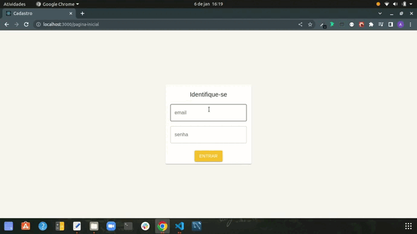

# Sistema de Cadastros

## Instruções para executar o projeto na sua maquina:

Abra seu terminal do Desktop e execute os passos abaixo:

1. Clone o repositório com a chave SSH.
   * `git clone git@github.com:andrelucca99/react-typescript-material-ui.git`
  * Entre na pasta do repositório que você acabou de clonar:
    * `cd react-typescript-material-ui`

2. Instale as dependências do projeto:

    * `npm install`

3. Abrar em um editor de texto de sua preferência e execute os comandos a seguir no seu terminal:

   * Front-end: `npm start`
   * Back-end: `npm run mock`
* obs: Para rodar o projeto, use um terminal para cada comando mostrado acima.

#
## O que foi desenvolvimento

Esse projeto foi desenvolvido em `React` com `TypeScript` e `Material UI` como biblioteca de estilização.

Através desta aplicação, você poderá criar um CRUD de cadastros de pessoa e cidades. Onde é possível criar um novo cadastro de de usuario e poderá ser feita a atualização dos dados do mesmo e até mesmo deletar seus dados. Abaixo há um exemplo da aplicação rodando.

#

#
## Habilidades usadas e aprendidas nesse projeto:
  * Front-end
    * Boas práticas em desenvolver a arquitetura do projeto
    * Componentização em React
    * Hooks: `useState`, `useEffect`, `useMemo`, `useRef`, `useCallback`, `createContext`, `hooks customizados`
    * Navegação pela página com `React Router Dom`
    * Themes - Dark mode
    * Material UI
  * Back-end
    * Validação com o `yup`
    * Requisições através do `axios`
    * Mock de simulação de dados com `JSON Server`
    * Criação de formulários através da API do <a href="https://github.com/unform/unform" target="_blank">unform</a>
